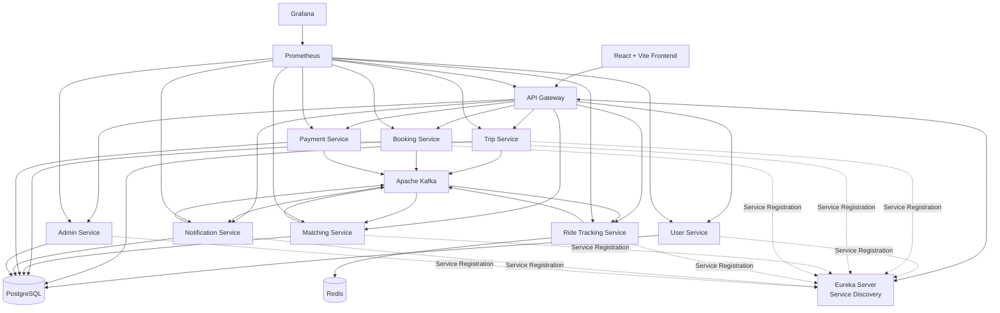
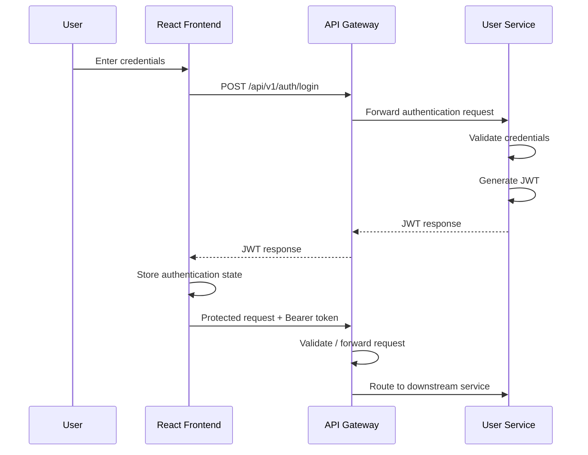
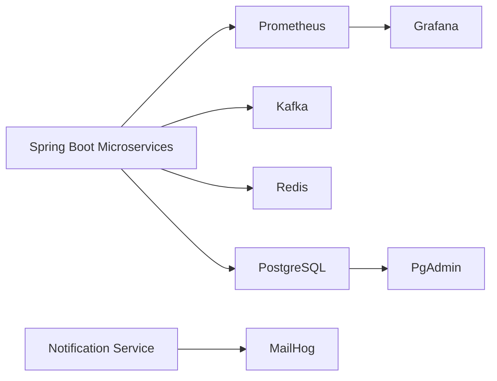

# CampusMate — College Commute Sharing Platform

> A production-oriented microservices platform designed to simplify daily college commuting through shared rides, trip discovery, booking workflows, real-time ride tracking, notifications, and centralized administration.

CampusMate is a **college-focused commute-sharing platform** built for students and campus communities. Unlike a generic ride-hailing platform, CampusMate focuses on the recurring transportation needs of students traveling between common locations such as campuses, hostels, residential areas, and major city pickup points.

The platform is built using a **microservices architecture** with Spring Boot, React, PostgreSQL, Kafka, Redis, Docker, service discovery, centralized routing, and observability tooling.

---

## 📌 Table of Contents

* [Overview](#overview)
* [Problem Statement](#problem-statement)
* [Solution](#solution)
* [Key Features](#key-features)
* [System Architecture](#system-architecture)
* [Architecture Explanation](#architecture-explanation)
* [Microservices](#microservices)
* [Technology Stack](#technology-stack)
* [Authentication & Security](#authentication--security)
* [Event-Driven Communication](#event-driven-communication)
* [Infrastructure & Observability](#infrastructure--observability)
* [Verified End-to-End Flows](#verified-end-to-end-flows)
* [Configuration Profiles](#configuration-profiles)
* [Project Structure](#project-structure)
* [Running Locally](#running-locally)
* [Running with Docker](#running-with-docker)
* [API Gateway](#api-gateway)
* [Architecture Decisions](#architecture-decisions)
* [Future Enhancements](#future-enhancements)

---

# Overview

CampusMate is designed around the idea that college transportation has different requirements from conventional ride-hailing systems.

Students frequently travel:

* To and from college campuses
* Between hostels and campuses
* From common city pickup points
* Along recurring daily or weekly routes

CampusMate provides a centralized platform where users can discover rides, publish trips, participate in shared commuting, manage vehicles and trips, and interact with the platform through a unified frontend.

The backend uses independently deployable services while maintaining centralized routing, service discovery, asynchronous event communication, and infrastructure-level observability.

---

# Problem Statement

Daily college commuting often involves fragmented transportation arrangements.

Students may need to:

* Search for classmates traveling along similar routes
* Coordinate recurring trips manually
* Find available rides at suitable times
* Manage limited vehicle capacity
* Track ride progress
* Receive notifications about ride activity
* Coordinate pickup and destination details

Traditional ride-hailing platforms are not specifically designed around recurring campus transportation communities.

CampusMate addresses this by providing a platform focused on **college commute sharing and coordinated transportation workflows**.

---

# Solution

CampusMate provides a microservices-based backend that separates major business domains into independent services.

The platform supports a workflow such as:

```text
User Registration/Login
        ↓
Role-Based Authentication
        ↓
Driver publishes a trip
        ↓
Trip becomes available for discovery
        ↓
Rider searches for matching trips
        ↓
Booking and matching workflows
        ↓
Ride tracking and notifications
```

The architecture allows different business domains to evolve independently while using shared infrastructure for routing, discovery, messaging, caching, persistence, and monitoring.

---

# Key Features

## 👤 User Management

* User registration
* User authentication
* JWT-based authentication
* User profile access
* Role-based access support
* Driver and rider workflows

## 🚗 Trip Management

* Publish rides
* Define source and destination
* Configure available seats
* Configure pricing
* Associate trips with drivers and vehicles
* Retrieve driver trips
* Search available trips

## 🔍 Ride Discovery and Matching

* Search trips based on travel requirements
* Match riders with available trips
* Support commute-sharing workflows

## 📅 Booking Management

* Booking-related business operations
* Seat and trip participation workflows
* Separation of booking responsibilities from trip management

## 📍 Ride Tracking

* Dedicated ride-tracking service
* Redis-backed configuration for fast-changing tracking data
* Infrastructure prepared for live ride-state workflows

## 🔔 Notifications

* Dedicated notification service
* Event-driven architecture support through Kafka
* Email development infrastructure using MailHog

## 💳 Payments

* Independent payment service
* Separation of payment responsibilities from trip and booking services

## 🛠 Administration

* Dedicated admin authentication
* Admin profile access
* Independent administrative service boundary

## 📊 Observability

* Prometheus metrics collection
* Grafana dashboards
* Centralized monitoring infrastructure

---

# System Architecture



---

# Architecture Explanation

The architecture follows a layered distributed design.

```text
                    ┌─────────────────────┐
                    │   React Frontend    │
                    │    Vite + React     │
                    └──────────┬──────────┘
                               │
                               ▼
                    ┌─────────────────────┐
                    │     API Gateway     │
                    │ Routing + Security  │
                    └──────────┬──────────┘
                               │
          ┌────────────────────┼────────────────────┐
          │                    │                    │
          ▼                    ▼                    ▼

      User Service         Trip Service       Booking Service

          │                    │                    │

          └─────────────┬──────┴──────┬─────────────┘
                        │             │
                        ▼             ▼

                     PostgreSQL      Kafka
                                      │
                 ┌────────────────────┼────────────────────┐
                 ▼                    ▼                    ▼
           Notification          Matching            Ride Tracking
              Service             Service              Service
                                                          │
                                                          ▼
                                                        Redis

                        ┌────────────────────┐
                        │    Eureka Server   │
                        │ Service Discovery  │
                        └────────────────────┘
```

---

# Microservices

## API Gateway

The API Gateway acts as the main entry point for client requests.

### Responsibilities

* Routes requests to backend services
* Provides centralized access to the microservice ecosystem
* Participates in JWT authentication handling
* Uses service discovery for routing

### Example

```text
Frontend
   │
   ▼
http://localhost:8080
   │
   ├── /api/v1/auth/**
   │         ↓
   │    User Service
   │
   ├── /api/v1/trips/**
   │         ↓
   │    Trip Service
   │
   └── /admin-service/**
             ↓
        Admin Service
```

---

## Eureka Server

Eureka provides service discovery.

Instead of services needing to permanently know every service address, services can register themselves with the discovery server.

```text
User Service ──────┐
Trip Service ──────┤
Booking Service ───┤
Matching Service ──┤
Payment Service ───┤──► Eureka Server
Notification ──────┤
Ride Tracking ─────┤
Admin Service ─────┘
```

This supports service-oriented routing and dynamic service resolution.

---

## User Service

The User Service manages the primary user authentication and user domain.

### Responsibilities

* User registration
* User login
* JWT generation
* Password authentication
* User profile access
* User role handling

### Verified Flow

```text
POST /api/v1/auth/login
          │
          ▼
     User Service
          │
          ▼
Validate Credentials
          │
          ▼
Generate JWT
          │
          ▼
       200 OK
```

---

## Trip Service

The Trip Service manages the core ride publishing and trip discovery domain.

### Responsibilities

* Publish rides
* Manage trip information
* Associate trips with drivers
* Associate vehicles with trips
* Retrieve driver trips
* Search available trips

### Verified Trip Creation

```text
Driver
  │
  ▼
POST /api/v1/trips
  │
  ▼
API Gateway
  │
  ▼
Trip Service
  │
  ├── Validate JWT
  │
  ├── Identify Driver
  │
  ├── Validate Trip Data
  │
  └── Persist Trip
        │
        ▼
     PostgreSQL
        │
        ▼
    201 CREATED
```

---

## Booking Service

The Booking Service separates booking responsibilities from trip publishing.

### Intended Service Boundary

```text
Trip Service
     │
     │ Trip Availability
     ▼
Booking Service
     │
     ├── Booking Operations
     ├── Seat Participation
     └── Trip Booking Workflow
```

This separation prevents trip management and booking logic from becoming tightly coupled.

---

## Matching Service

The Matching Service represents the domain responsible for matching commute requirements with available transportation opportunities.

### Architecture Role

```text
User Travel Requirement
          │
          ▼
    Matching Service
          │
          ├── Evaluate Available Trips
          │
          ├── Process Matching Logic
          │
          ▼
      Match Result
```

Kafka can support asynchronous communication for matching-related workflows.

---

## Payment Service

The Payment Service isolates payment-related responsibilities from other business domains.

This avoids coupling payment concerns directly into trip or booking services.

```text
Booking Workflow
       │
       ▼
Payment Service
       │
       ▼
Payment Processing Domain
```

---

## Notification Service

The Notification Service handles communication generated by platform activity.

Kafka allows services to publish events without directly depending on notification delivery logic.

```text
Trip Event
    │
    ▼
Kafka Topic
    │
    ▼
Notification Service
    │
    ├── Email
    ├── Notification Processing
    └── User Communication
```

MailHog is included in the local development infrastructure for email testing.

---

## Ride Tracking Service

The Ride Tracking Service is responsible for ride-state and tracking-related functionality.

Redis is configured as supporting infrastructure for fast-changing data.

```text
Ride Update
     │
     ▼
Ride Tracking Service
     │
     ├── Redis
     │     │
     │     └── Fast-changing ride data
     │
     └── Kafka
           │
           └── Event communication
```

---

## Admin Service

The Admin Service provides an independent boundary for administrative functionality.

### Verified Capabilities

* Admin authentication
* Admin JWT generation
* Admin profile access

Example:

```text
POST /admin-service/api/v1/auth/login
                │
                ▼
           Admin Service
                │
                ▼
         Admin JWT Response
```

---

# Authentication & Security

CampusMate uses JWT-based authentication.

The system uses a standardized HMAC-SHA256 signing key derivation approach across the Gateway and backend services.



The standardized configuration ensures compatible JWT signing and verification across services.

---

# Event-Driven Communication

CampusMate uses Apache Kafka for asynchronous communication between services.

The event-driven approach allows services to communicate without requiring direct synchronous dependencies for every workflow.

```text
┌──────────────┐
│ Trip Service │
└──────┬───────┘
       │
       │ Event
       ▼
┌──────────────┐
│    Kafka     │
└──────┬───────┘
       │
       ├──────────────► Notification Service
       │
       ├──────────────► Matching Service
       │
       └──────────────► Ride Tracking Service
```

### Benefits

* Reduced service coupling
* Asynchronous processing
* Better scalability for event workflows
* Independent consumers
* Extensible architecture

---

# Infrastructure & Observability

CampusMate includes supporting infrastructure for development and monitoring.



## Prometheus

Used for metrics collection from application services.

## Grafana

Used to visualize metrics collected by Prometheus.

## PostgreSQL

Used as the primary relational persistence layer.

## Redis

Used as fast-access infrastructure for ride-tracking-related data.

## Kafka

Used for asynchronous event-driven communication.

## MailHog

Used for local email testing.

## pgAdmin

Used for PostgreSQL administration during development.

---

# Technology Stack

## Backend

| Technology           | Usage                              |
| -------------------- | ---------------------------------- |
| Java 21              | Backend programming language       |
| Spring Boot          | Microservice framework             |
| Spring Cloud         | Distributed service infrastructure |
| Spring Cloud Gateway | API routing                        |
| Netflix Eureka       | Service discovery                  |
| Spring Security      | Authentication and authorization   |
| JWT                  | Stateless authentication           |
| Spring Data JPA      | Database access                    |
| Hibernate            | ORM                                |
| Maven                | Build management                   |

## Data & Messaging

| Technology   | Usage                       |
| ------------ | --------------------------- |
| PostgreSQL   | Relational database         |
| Redis        | Fast-access / tracking data |
| Apache Kafka | Event-driven communication  |

## Frontend

| Technology | Usage                                  |
| ---------- | -------------------------------------- |
| React      | User interface                         |
| Vite       | Frontend development and build tooling |
| TypeScript | Frontend application development       |

## Infrastructure

| Technology     | Usage                         |
| -------------- | ----------------------------- |
| Docker         | Containerization              |
| Docker Compose | Multi-container orchestration |
| Prometheus     | Metrics collection            |
| Grafana        | Metrics visualization         |
| MailHog        | Local email testing           |
| pgAdmin        | Database administration       |

---

# Verified End-to-End Flows

The following flows were explicitly tested successfully in the current project state.

| Flow                              | Result   |
| --------------------------------- | -------- |
| User Login                        | ✅ Passed |
| User Profile                      | ✅ Passed |
| Admin Login                       | ✅ Passed |
| Admin Profile                     | ✅ Passed |
| Driver Login                      | ✅ Passed |
| Publish Ride                      | ✅ Passed |
| Driver Trip Listing               | ✅ Passed |
| Trip Search                       | ✅ Passed |
| Gateway Proxy / College Directory | ✅ Passed |
| React Frontend Loading            | ✅ Passed |

## Verified User Login

```text
POST /api/v1/auth/login
```

Response:

```text
200 OK
```

A valid JWT is returned.

---

## Verified User Profile

```text
GET /api/v1/users/me
Authorization: Bearer <UserToken>
```

Response:

```text
200 OK
```

---

## Verified Admin Login

```text
POST /admin-service/api/v1/auth/login
```

Response:

```text
200 OK
```

---

## Verified Trip Publishing

```text
POST /api/v1/trips
Authorization: Bearer <DriverToken>
```

Response:

```text
201 CREATED
```

The verified flow included:

* Driver authentication
* JWT validation
* Driver identification
* Vehicle attachment
* Trip creation
* Database persistence

---

# Configuration Profiles

CampusMate supports multiple execution modes.

## Mode 1 — Local Development

Used when running services directly from an IDE or Maven.

Typical infrastructure addresses:

```text
PostgreSQL → localhost:5432
Redis      → localhost:6379
Kafka      → localhost:9092
Eureka     → localhost:8761
Gateway    → localhost:8080
```

---

## Mode 2 — Docker Compose

Activated using the Docker Spring profile.

Services communicate using Docker network hostnames.

Example:

```text
postgres
redis
kafka
eureka-server
user-service
trip-service
booking-service
```

---

## Mode 3 — Cloud Deployment

Configuration values support environment-variable overrides.

Examples:

```text
PORT
DB_URL
DB_USERNAME
DB_PASSWORD
KAFKA_BOOTSTRAP_SERVERS
JWT_SECRET
EUREKA_SERVER_URL
REDIS_HOST
REDIS_PORT
```

The configuration is designed so cloud infrastructure can override service settings without changing the source configuration.

---

# Project Structure

```text
CampusMate/
│
├── frontend/
│   │
│   ├── src/
│   │   ├── features/
│   │   ├── pages/
│   │   ├── components/
│   │   ├── routes/
│   │   └── ...
│   │
│   └── package.json
│
├── backend/
│   │
│   ├── api-gateway/
│   │
│   ├── eureka-server/
│   │
│   ├── user-service/
│   │
│   ├── trip-service/
│   │
│   ├── booking-service/
│   │
│   ├── matching-service/
│   │
│   ├── payment-service/
│   │
│   ├── notification-service/
│   │
│   ├── ride-tracking-service/
│   │
│   ├── admin-service/
│   │
│   ├── shared-kernel/
│   │
│   ├── common-events/
│   │
│   ├── docker-compose.yml
│   │
│   └── pom.xml
│
└── README.md
```

---

# Running Locally

## Prerequisites

Install:

* Java 21
* Maven
* Node.js
* Docker Desktop
* PostgreSQL
* Redis
* Apache Kafka

Or use the provided Docker infrastructure.

## Build Backend

From the backend directory:

```bash
mvn clean package -DskipTests
```

## Start Frontend

```bash
cd frontend
npm install
npm run dev
```

The frontend runs at:

```text
http://localhost:5173
```

---

# Running with Docker

From the backend directory:

```bash
docker compose up -d --build
```

Check container status:

```bash
docker ps
```

The verified full Docker environment includes:

```text
PostgreSQL
Redis
Kafka
Eureka Server
API Gateway
User Service
Trip Service
Booking Service
Matching Service
Payment Service
Notification Service
Ride Tracking Service
Admin Service
MailHog
Prometheus
Grafana
pgAdmin
```

Stop the stack:

```bash
docker compose down
```

Stop and remove volumes:

```bash
docker compose down -v
```

---

# API Gateway

The local API Gateway is available at:

```text
http://localhost:8080
```

Examples:

### User Login

```http
POST /api/v1/auth/login
```

### User Profile

```http
GET /api/v1/users/me
Authorization: Bearer <JWT>
```

### Publish Trip

```http
POST /api/v1/trips
Authorization: Bearer <Driver JWT>
```

### Search Trips

```http
GET /api/v1/trips/search
Authorization: Bearer <JWT>
```

### Driver Trips

```http
GET /api/v1/trips/driver
Authorization: Bearer <Driver JWT>
```

### College Directory

```http
GET /api/v1/colleges
```

### Admin Login

```http
POST /admin-service/api/v1/auth/login
```

---

# Architecture Decisions

## Why Microservices?

CampusMate contains multiple distinct business domains:

```text
Users
Trips
Bookings
Matching
Payments
Notifications
Ride Tracking
Administration
```

Keeping these domains independent reduces the risk of a single large backend becoming tightly coupled.

---

## Why API Gateway?

The frontend should not need to directly manage every microservice address.

The Gateway provides:

```text
Frontend
    │
    ▼
Single Entry Point
    │
    ▼
Multiple Backend Services
```

---

## Why Eureka?

In a distributed system, service addresses should not need to be hard-coded everywhere.

Eureka provides a centralized discovery mechanism for service registration and lookup.

---

## Why Kafka?

Some operations are better handled asynchronously.

For example:

```text
Trip Event
    ↓
Kafka
    ├── Notification Processing
    ├── Matching Processing
    └── Ride-State Processing
```

This reduces direct dependencies between services.

---

## Why Redis?

Ride tracking can involve rapidly changing state.

Redis provides low-latency infrastructure suitable for fast-changing application data.

---

## Why Docker Compose?

CampusMate contains multiple applications and infrastructure components.

Docker Compose allows the complete environment to be started together:

```text
Application Services
        +
PostgreSQL
        +
Redis
        +
Kafka
        +
Monitoring
        =
Single Development Environment
```

---

# Production-Readiness Verification

The current audited state verified:

```text
Maven Multi-Module Build
        ↓
BUILD SUCCESS

Git Configuration Validation
        ↓
git diff --check → CLEAN

Docker Compose
        ↓
17 Containers Running

End-to-End Flows
        ↓
10 / 10 VERIFIED
```

The project supports:

* Local development configuration
* Docker Compose configuration
* Environment-variable-based cloud configuration

---

# Future Enhancements

The following are potential areas for further development and are not presented here as already verified production features:

* WebSocket-based live location updates
* Advanced route optimization
* Automated recurring commute scheduling
* Push notifications
* Payment gateway integration
* Distributed tracing
* Alerting rules
* Production-grade Grafana dashboards
* Advanced matching algorithms
* Rate limiting and API resilience policies
* Kubernetes deployment
* CI/CD pipeline automation
* Mobile application

---

# Resume Summary

**CampusMate — College Commute Sharing Platform**

> Built a production-oriented college commute-sharing platform using a microservices architecture with Java 21, Spring Boot, React, PostgreSQL, Redis, Apache Kafka, Spring Cloud Gateway, Eureka, JWT authentication, Docker, Prometheus, and Grafana. Implemented independent services for users, trips, bookings, matching, payments, notifications, ride tracking, and administration, with verified end-to-end authentication, trip publishing, search, service routing, and Docker-based deployment workflows.

---

# Project Status

**Current Status: Functional Local & Docker Environment Verified**

* Multi-module Maven build: **Passing**
* Docker stack: **Healthy**
* User authentication: **Verified**
* Admin authentication: **Verified**
* Driver workflow: **Verified**
* Trip publishing: **Verified**
* Trip search: **Verified**
* Gateway routing: **Verified**
* Frontend: **Verified**

---

## 👨‍💻 Author

**K. S. Vasanth Kumar**

GitHub: [GitHub Profile](https://github.com/vasanth8055?utm_source=chatgpt.com)

---

## 📄 License

This project is currently intended for educational, portfolio, and academic use.
